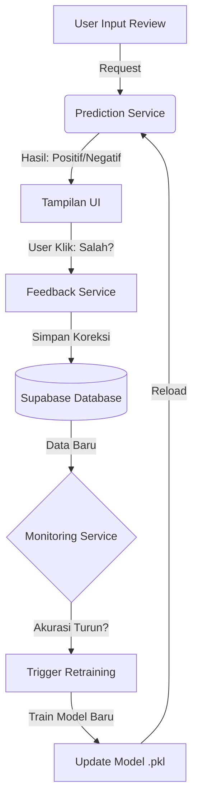

# Sentiment Analysis MLOps Pipeline: Continuous Learning System

Sistem Klasifikasi Sentimen End-to-End yang "Hidup": mampu memprediksi, menerima umpan balik pengguna, memantau performa, dan melakukan pelatihan ulang (retraining) otomatis.

**Fokus utama:** analisis berdasarkan keseluruhan teks — kata, frasa, emoji, sarkasme, kiasan, dan konteks — bukan hanya emoji.

---

**Arsitektur Sistem (The Big Picture)**



Komponen:
- Frontend: `Streamlit` (UI pengguna + admin monitoring)
- Prediction Service: `services/prediction_service.py` (TF-IDF + Naive Bayes), juga mengekstrak metadata (emoji, sarcasm heuristics, token count)
- Storage: `Supabase` (Postgres) — optional. Jika tidak ada kredensial, sistem otomatis pakai SQLite fallback `database/feedback.db`
- Model registry: `models/saved_model` dan `models/archive`
- Retraining: `services/retraining_service.py`

## Siklus Hidup (Operational Workflow)
1. User mengirim teks ke Streamlit.
2. Prediction Service mengembalikan label + probabilitas (persentase) dan metadata analisis.
3. Prediksi langsung dicatat ke DB sebagai _unlabeled example_ (user_label = NULL).
4. User menilai prediksi (Benar / Salah). Bila Salah, user dapat memilih label yang benar.
5. Feedback tersimpan di DB dan dipakai untuk monitoring.
6. Jika akurasi menurun (threshold), `retraining_service` dapat dipanggil untuk melatih model baru dan mengganti model lama secara aman.

## Demo UI (apa yang dilakukan Streamlit)
- Kotak teks input (contoh: "saya sudah makan").
- Tombol `Prediksi` yang menampilkan:
  - Label prediksi.
  - Persentase untuk setiap label (probabilitas dikonversi ke persen dan ditampilkan sebagai tabel).
  - Analisis metadata (jumlah emoji, indikasi sarkasme, token count).
- Prediksi otomatis tersimpan ke DB untuk mengumpulkan data.
- Tombol feedback: `Benar` / `Salah` + opsi memilih label yang benar. Feedback disimpan untuk evaluasi dan retraining.

## Gambar & Demo (letakkan file berikut di root repo supaya tampil di README)
- `output_1.png` — The Big Picture Architecture
- `output_2.png` — The Feedback Loop (UI -> DB)
- `output_3.png` — Model Evolution (timeline)

> Anda bisa merekam alur Prediksi -> Feedback -> Monitoring menjadi GIF dan tambahkan di bagian Demo.

## CI/CD (GitHub Actions) — saran cepat
- Setup: jalankan unit tests, lint, dan validasi model sebelum merge.
- Contoh file workflow: `.github/workflows/ci.yml` (jalankan `pytest`, `flake8`, dan build artifact model jika diperlukan).
- Deployment: jika retraining menghasilkan model baru yang lulus validasi, push artifact `models/saved_model/model.pkl` dan trigger deployment service (bisa via GitHub Actions yang memindahkan file ke server/objek storage atau memanggil endpoint deploy).

## Quick Start (Local)
Prasyarat: Python 3.9+, (opsional) akun Supabase

1) Clone repository

```powershell
git clone <repo-url>
cd <repo-folder>
```

2) Copy file env

```powershell
copy .env.example .env
# Isi SUPABASE_URL & SUPABASE_KEY jika ingin menggunakan Supabase
```

3) Install dependencies

```powershell
pip install -r requirements.txt
```

4) (Opsional) Setup Supabase
- Jalankan isi `database/schema.sql` di SQL editor Supabase untuk membuat tabel `feedback`.

5) Jalankan Streamlit

```powershell
streamlit run app.py
```

## Struktur Proyek
```
mlops-project/
├── services/
│   ├── prediction_service.py
│   └── retraining_service.py
├── models/
│   ├── saved_model/  # aktif model.pkl
│   └── model_updater.py
├── ui/
│   ├── main_area.py
│   └── monitoring.py
├── database/
│   └── db_manager_supabase.py (sqlite fallback)
├── app.py
├── requirements.txt
└── README.md
```

## Database Schema
- `database/schema.sql` tersedia untuk Supabase.
- Jika tidak menggunakan Supabase, sistem membuat `database/feedback.db` otomatis.

## Notes & Rekomendasi
- Untuk deteksi sarkasme/irony yang kuat: pertimbangkan model transformer (fine-tune BERT/IndoBERT) sebagai upgrade.
- Untuk production-grade CI/CD: sediakan validation steps (data validation, holdout test, ML checks) sebelum melakukan auto-deploy model baru.

---
Dibuat untuk tugas MLOps, fokus pada continuous learning dan human-in-the-loop.
